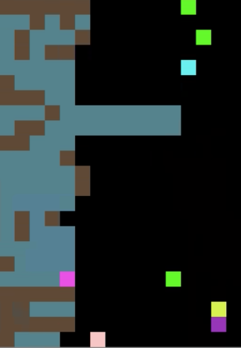
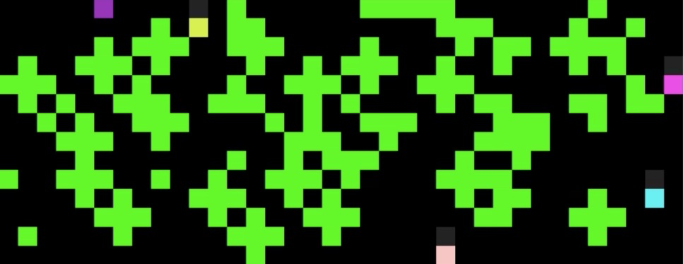
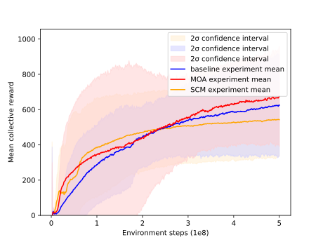
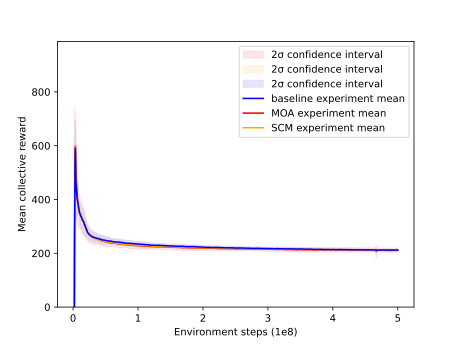

[](https://travis-ci.com/eugenevinitsky/sequential_social_dilemma_games)

# Sequential Social Dilemma Games
This repo is an open-source implementation of DeepMind's Sequential Social Dilemma (SSD) multi-agent game-theoretic environments [[1]](https://arxiv.org/abs/1702.03037). SSDs can be thought of as analogous to spatially and temporally extended Prisoner's Dilemma-like games. The reward structure poses a dilemma because individual short-term optimal strategies lead to poor long-term outcomes for the group.

The implemented environments are structured to be compatible with [OpenAIs gym environments](https://github.com/openai/gym) as well as [RLlib's Multiagent Environment](https://github.com/ray-project/ray/blob/master/rllib/env/multi_agent_env.pyhttps://github.com/ray-project/ray/blob/master/python/ray/rllib/env/multi_agent_env.py)

## Implemented Games

* **Cleanup**: A public goods dilemma in which agents get a reward for consuming apples, but must use a cleaning beam to clean a river in order for apples to grow. While an agent is cleaning the river, other agents can exploit it by consuming the apples that appear.



* **Harvest**: A tragedy-of-the-commons dilemma in which apples regrow at a rate that depends on the amount of nearby apples. If individual agents employ an exploitative strategy by greedily consuming too many apples, the collective reward of all agents is reduced.




The above plot shows the empirical Schelling diagrams for both Cleanup (A) and Harvest (B) (from [[2]](https://arxiv.org/abs/1803.08884)). These diagrams show the payoff that an individual agent can expect if it follows a defecting/exploitative strategy (red) vs a cooperative strategy (blue), given the number of other agents that are cooperating.  We can see that an individual agent can almost always greedily benefit from detecting, but the more agents that defect, the worse the outcomes for all agents.  

# Setup instructions
```
git clone -b master https://github.com/eugenevinitsky/sequential_social_dilemma_games
cd sequential_social_dilemma_games
python3 -m venv venv # Create a Python virtual environment
. venv/bin/activate
pip3 install --upgrade pip setuptools wheel
python3 setup.py develop
pip3 install -r requirements.txt
# Patch ray due to https://github.com/ray-project/ray/issues/7946
# And https://github.com/ray-project/ray/pull/8491
. ray_uint8_patch.sh 
cd run_scripts
```

After the setup, you can run experiments like so:
- To train with default parameters (baseline model cleanup with 2 agents):
`python3 train.py`

- To train the MOA with 5 agents:
`python3 train.py --model moa --num_agents 5`

Many more options are available which can be found in [default_args.py](config/default_args.py). A collection of preconfigured training scripts can be found in [run_scripts](run_scripts). 

Note that the initialization time can be rather high (up to 5 minutes) the more agents you use, and the more complex your used model is.

# CUDA, cuDNN and tensorflow-gpu

If you run into any cuda errors, make sure you've got a [compatible set](https://www.tensorflow.org/install/source#tested_build_configurations) of cuda/cudnn/tensorflow versions installed. However, beware of the following:
>The compatibility table given in the tensorflow site does not contain specific minor versions for cuda and cuDNN. However, if the specific versions are not met, there will be an error when you try to use tensorflow. [source](https://stackoverflow.com/a/53727997)

A configuration that works for me is:
- CUDA 10.1.105
- cuDNN 7.6.5
- tensorflow-gpu 2.1.0 (this is automatically installed during with the above script, see [requirements.txt](requirements.txt))

# Tests
Tests are located in the test folder and can be run individually or run by running `python -m pytest`. Many of the less obviously defined rules for the games can be understood by reading the tests, each of which outline some aspect of the game. 

# Constructing new environments
Every environment that subclasses MapEnv probably needs to implement the following methods

```
    def custom_reset(self):
        """Reset custom elements of the map. For example, spawn apples"""
        pass

    def custom_action(self, agent, action):
        """Execute any custom, non-move actions that may be defined, like fire or clean"""
        pass

    def custom_map_update(self):
        """Custom map updates that don't have to do with agent actions"""
        pass

    def setup_agents(self):
        """Construct all the agents for the environment"""
        raise NotImplementedError
```

## PPO Results

The below graphs display results for cleanup/harvest using un-tuned PPO. As of yet, A3C remains untested.

**Collective cleanup reward**:



**Collective harvest reward**:




## Relevant papers

1. Leibo, J. Z., Zambaldi, V., Lanctot, M., Marecki, J., & Graepel, T. (2017). [Multi-agent reinforcement learning in sequential social dilemmas](https://arxiv.org/abs/1702.03037). In Proceedings of the 16th Conference on Autonomous Agents and MultiAgent Systems (pp. 464-473).

2.  Hughes, E., Leibo, J. Z., Phillips, M., Tuyls, K., Dueñez-Guzman, E., Castañeda, A. G., Dunning, I., Zhu, T., McKee, K., Koster, R., Tina Zhu, Roff, H., Graepel, T. (2018). [Inequity aversion improves cooperation in intertemporal social dilemmas](https://arxiv.org/abs/1803.08884). In Advances in Neural Information Processing Systems (pp. 3330-3340).

3. Jaques, N., Lazaridou, A., Hughes, E., Gulcehre, C., Ortega, P. A., Strouse, D. J., Leibo, J. Z. & de Freitas, N. (2018). [Intrinsic Social Motivation via Causal Influence in Multi-Agent RL](https://arxiv.org/abs/1810.08647). arXiv preprint arXiv:1810.08647.
        
# Contributors

This code base was initially developed by Eugene Vinitsky and Natasha Jaques; help with reproduction was provided by Joel Leibo, Antonio Castenada, and Edward Hughes. Additional development was done by Hugo Heemskerk. 

# Citation

If you want to cite this repository accademic work, please use the following citation:

@misc{SSDOpenSource,
author = {[Vinitsky, Eugene and Jaques, Natasha and Leibo, Joel and Castenada, Antonio and Hughes, Edward]},
title = {An Open Source Implementation of Sequential Social Dilemma Games},
year = {2019},
publisher = {GitHub},
note = {GitHub repository},
howpublished = {\url{https://github.com/eugenevinitsky/sequential_social_dilemma_games/issues/182}}
}
